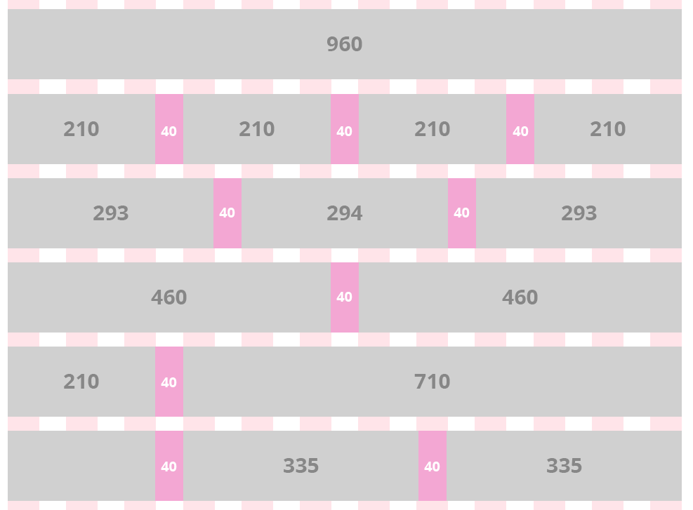
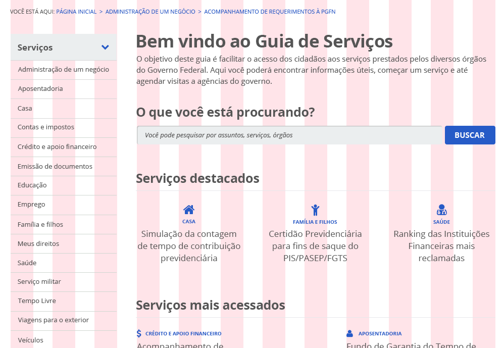

# Grade

A partir da grade existente no [Manual de Identidade Visual do Governo Federal][estilos], reconstruímos a grade que está sendo utilizado no Guia de Estilos. Esta grade consiste em uma largura máxima de 960 pixels e possui 12 colunas, que quando combinadas, formam os blocos de conteúdo do site. Realizamos esta reconstrução da grade, principalmente em função da área de menu lateral, que antes ocupava apenas 150px de largura (ou seja, não comportava a quantidade de conteúdo necessária neste projeto). Esta grade está projetada para funcionar responsivamente. Temos a flexibilidade de criar diversos layouts combinando a configuração de colunas e conteúdo.

[estilos]:http://www.secom.gov.br/orientacoes-gerais/comunicacao-digital/guia-de-estilo-identidade-padrao-comunicacao-digital-fev2015.pdf

A imagem abaixo representa a grade do Portal de Serviços, e a variedade de combinações possíveis de colunas:



Exemplo de como o grid se comporta organizando as informações no protótipo do Portal de Serviços. Por exemplo, o menu esquerdo ocupa 3 colunas, enquanto a busca (campo e botão) na direita ocupa 9 colunas.



Exemplo de como o código da grade funciona:

```
@import 'grid'

@include span-columns(1)
@include span-columns(2)
@include span-columns(3)
...
@include span-columns(12)
```
