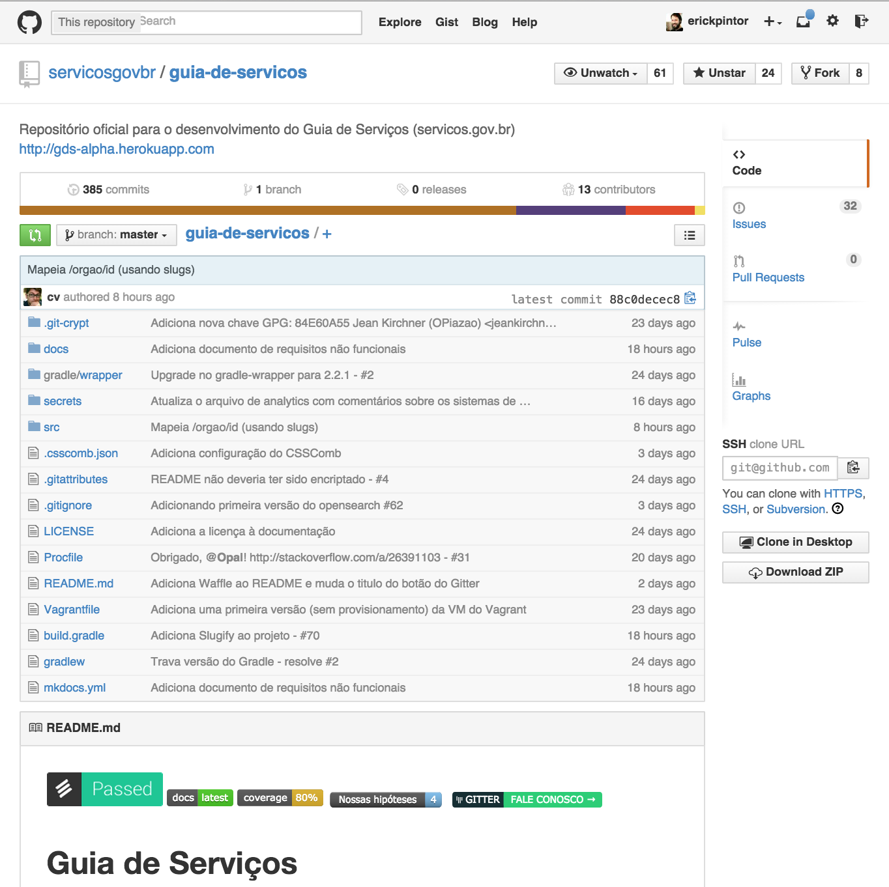
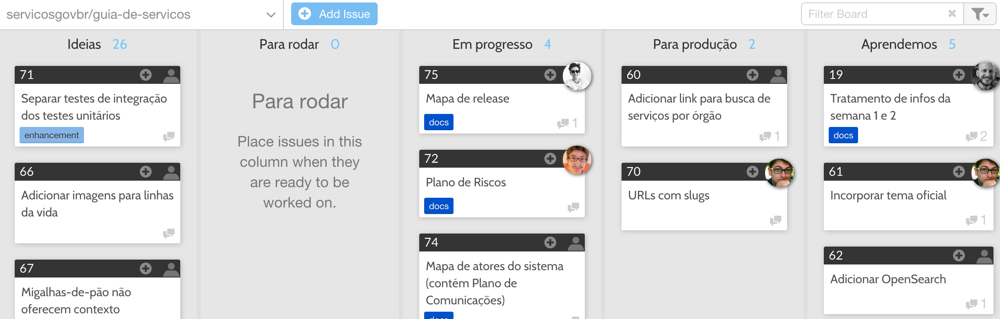
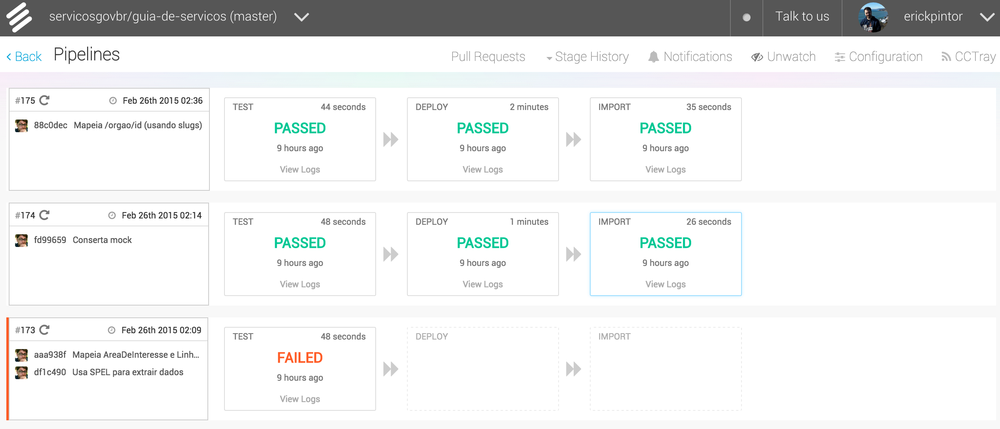
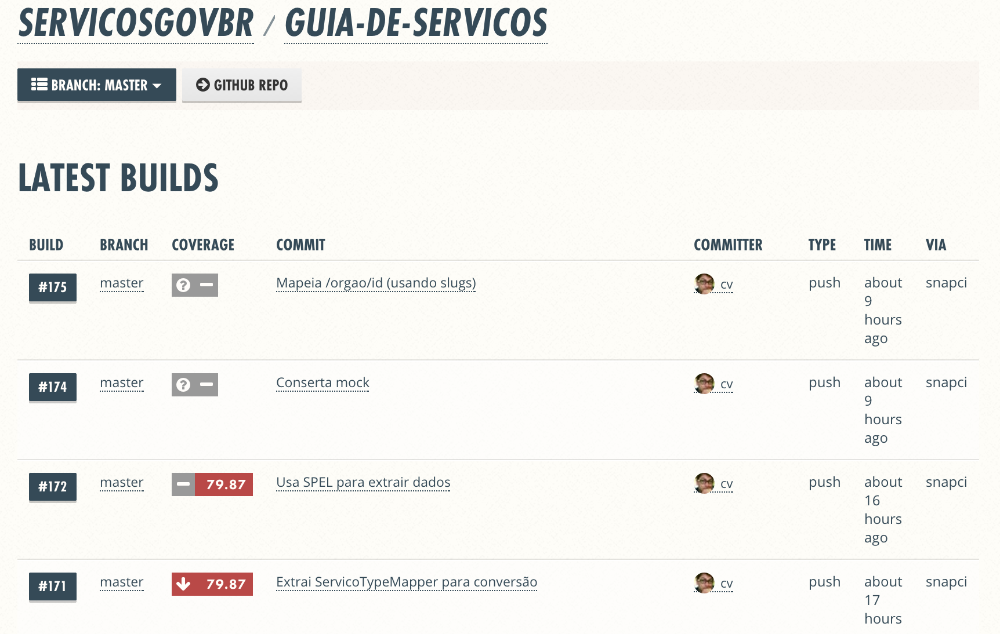

_Definição extraída do Termo de Referência:_

> Plano de Iterações pelo Método Ágil: documenta como as equipes do projeto irão utilizar o Método Ágil (SCRUM) ao longo do projeto.  Deverá indicar a ferramenta apropriada para uso do Método. Também faz parte do plano de projetos uma visão mais pormenorizada da metodologia a ser adotada e de seus fatores críticos de sucesso. No entanto, o método a ser adotado só será definido na primeira fase do projeto assim como todas as ferramentas que serão utilizadas.

Metodologia
===========

Mantendo em mente nossos princípios base, definidos durante as primeiras interações entre o time da ThoughtWorks com o tipo do Guia de Serviços, os quais são:

0. O cidadão é o principal beneficiado
0. O serviço deve ser simples para todos
0. Aprenda com o cidadão
0. Os serviços estão em constante evolução
0. Adoção a partir de exemplos
0. Os serviços devem ser tangíveis

Elaboramos uma metodologia de trabalho que, assim como os serviços que visamos evoluir, estará em constante aprimoramento.

Visando um ambiente de constante aprendizado e guiado a partir de evidências que validem nossas premissas, escolhemos um modelo de trabalho baseado em hipóteses. Hipóteses são idéias, não necessariamente em seu estado final, mas que acreditamos que entreguem algum valor ao cidadão que necessita de um serviço público.

Segue abaixo um exemplo de hipótese definida durante nossa semana de iniciação:

    Acreditamos que:
        ao adaptar a linguagem da descrição do serviço

    Para:
       o cidadão

    Obteremos como resultado:
        o usuário ter o entendimento com clareza se ele é elegível ou não para aquele serviço

    Saberemos que atingimos o resultado quando:
        * reduz a proporção de serviços indeferidos
        * diminui o número de atendimentos que não viram processos
        * reduz o número de exigências e/ou reduz o número de diligências

As hipóteses serão priorizadas de acordo com o valor entregue ao cidadão versus o esforço necessário para que o valor seja entregue visando que, de forma iterativa e incremental, dando pequenos passos e acumulando aprendizado, possamos validar ou refutar nossas hipóteses.

Métricas assumem um papel essencial na validação de nossas hipóteses. Visando sempre aprender com o cidadão, cada hipótese deverá sempre ser acompanhada de uma métrica que nos ajude a compreender se a premissa assumida até então é valida ou não. Como resultado, teremos um aprendizado baseado em evidências que nos permitirá refinar, eliminar ou criar novas hipóteses e experimentos.

Seguindo este pensamento de que nosso resultado vai além do software entregue e se baseia no aprendizado gerado por cada hipótese testada, o fluxo de trabalho foi organizado na seguinte forma:

* _Idéias_ -> _Para rodar_ -> _Em progresso_ -> _Para produção_ -> ***Aprendemos***

Cada passo do fluxo de trabalho compreende uma parte de nosso experimento em busca de validar ou refutar uma hipótese. Sendo eles:

* ***Idéias:*** Hipóteses a serem priorizadas
* ***Para rodar:*** Hipóteses priorizadas a serem desenvolvidas
* ***Em progresso:*** Hipóteses sendo desenvolvidas por um ou mais membros do time
* ***Para produção:*** Hipóteses prontas para ser publicadas e testadas
* ***Aprendemos:*** Hipóteses testadas, métricas avaliadas e aprendizado registrado

Nossas hipóteses serão priorizadas e desenvolvidas visando iterações de 2 semanas de trabalho. Com uma retrospectiva a cada 2 iterações para refletirmos sobre o trabalho que tem sido feito e avaliar possíveis alterações no fluxo de trabalho, ferramentas utilizadas, ou quaisquer outros pontos de melhoria que possam ser atacados para tornar o projeto mais produtivo.

Teremos também, todos os dias pela manhã, uma reunião que chamamos de "Reunião em Pé" (tradução do termo stand-up meeting). Está é uma reunião rápida, de aproximadamente 15 minutos, visando o alinhamento do time com relação ao trabalho a ser efetuado além de identificar possíveis impedimentos que precisam ser resolvidos.

Showcases serão feitos a cada iteração comunicando assim tanto nosso aprendizado com relação ao trabalho desenvolvido até então, como documentos e apresentações a serem utilizadas para o acompanhamento do projeto.

Para nos auxiliar no desenvolvimento e acompanhamento de nossas hipóteses, escolhemos as seguintes ferramentas:

Ferramentas
===========

### Repositório de código fonte: [Github](https://github.com/servicosgovbr)

Github é o repositório onde o código fonte do projeto será armazenado.

A utilização do Github reforça nosso compromisso com a transparência com relação ao trabalho desenvolvido pelo time. Qualquer cidadão pode visualizar e revisar o código além de permitir que os interessados contribuam com novas funcionalidades, correções ou melhorias.

Uma nova organização foi criada no Github afim de agrupar qualquer projeto ou sub projeto relacionado ao Guia de Serviços.

Referências:

* Organização: [https://github.com/servicosgovbr](https://github.com/servicosgovbr)
* Projeto do Guia de Serviços: [https://github.com/servicosgovbr/guia-de-servicos](https://github.com/servicosgovbr/guia-de-servicos)

### Gerenciamento de hipóteses: [Github Issues](https://github.com/servicosgovbr/guia-de-servicos/issues)

Ferramenta integrada ao Github que permite a criação de tarefas a serem analisadas e desenvolvidas pelo time. Utilizaremos esta ferramenta para registrar e gerenciar nossas hipóteses e no decorrer do projeto.

Por ser uma ferramenta aberta, ela permite a colaboração de quaisquer interessados no projeto, seja sugerindo novas hipóteses, melhorias, reportando problemas ou, até mesmo, contribuindo com código e documentações.

Referências:

* Tarefas do projeto: [https://github.com/servicosgovbr/guia-de-servicos/issues](https://github.com/servicosgovbr/guia-de-servicos/issues)

### Quadro de tarefas: [Waffle](https://waffle.io/servicosgovbr/guia-de-servicos)

Waffle é um quadro virtual e integrado ao Github Issues que gera visualizações em tempo real de cada uma das tarefas e seu estado atual.

Utilizaremos esta ferramenta afim de dar mais visibilidade com relação as tarefas que estão sendo desenvolvidas pelo time e quem é o responsável por ela.

Referências:

* Quadro de tarefas do Guia de Serviços: [https://waffle.io/servicosgovbr/guia-de-servicos](https://waffle.io/servicosgovbr/guia-de-servicos)

### Ferramenta de integração contínua: [Snap-CI](https://snap-ci.com/servicosgovbr/guia-de-servicos/branch/master)

Snap-CI é uma ferramenta de integração continua. Ela se integra ao Github permitindo que, a cada novo código submetido, uma nova versão da aplicação seja compilada, testada, empacotada e publicada em um ambiente pre-definido.

Inicialmente estamos publicando as novas versões no Heroku. Uma plataforma gratuita, na nuvem, para publicação de aplicações.

Ao automatizar o processo de publicação do projeto, permitimos ciclos de feedback mais curtos, afim de identificar e agir sobre qualquer problema o mais rápido possível, melhorando assim a qualidade do produto final.

Referências:

* Integração continua do projeto: [https://snap-ci.com/servicosgovbr/guia-de-servicos/branch/master](https://snap-ci.com/servicosgovbr/guia-de-servicos/branch/master)

### Monitoramento da cobertura de testes: [Coveralls](https://coveralls.io/r/servicosgovbr/guia-de-servicos?branch=master)

Acreditamos que TDD, Test Driven Development (desenvolvimento orientado a testes), seja uma técnica crucial para o sucesso de projetos de desenvolvimento de software. Esta técnica consiste na criação de testes automatizados durante o desenvolvimento de cada nova funcionalidade da aplicação, obtendo como resultado, testes que garantem a consistência e qualidade do software ao longo de todo o projeto.

Coveralls permite visualizar a porcentagem de cobertura de testes da aplicação afim de garantir o acompanhamento constante da qualidade de nossos testes automatizados.

Referências:

* Analise de cobertura de testes: [https://coveralls.io/r/servicosgovbr/guia-de-servicos?branch=master](https://coveralls.io/r/servicosgovbr/guia-de-servicos?branch=master)

### Repositório de documentação: [Read the Docs](http://guia-de-servicos.readthedocs.org/pt_BR/latest/)

Read the Docs é uma ferramenta que compila textos escritos em formato Markdown e os disponibiliza em uma pagina na internet de forma navegável e indexada para buscas.

A documentação do projeto será escrita em formato Markdown, armazenada no Github do próprio projeto e, a cada alteração, Read the Docs irá automaticamente gerar uma nova versão da documentação e disponibilizá-la online.

Referências:

* Documentação do projeto: [http://guia-de-servicos.readthedocs.org/pt_BR/latest/](http://guia-de-servicos.readthedocs.org/pt_BR/latest/)

### Comunicação por meio de mensagens instantâneas: [Gitter](https://gitter.im/servicosgovbr/guia-de-servicos)

Gitter é um comunicador instantâneo que permite a participação de qualquer interessado no projeto.

Referências:

* Sala do projeto: [https://gitter.im/servicosgovbr/guia-de-servicos](https://gitter.im/servicosgovbr/guia-de-servicos)
