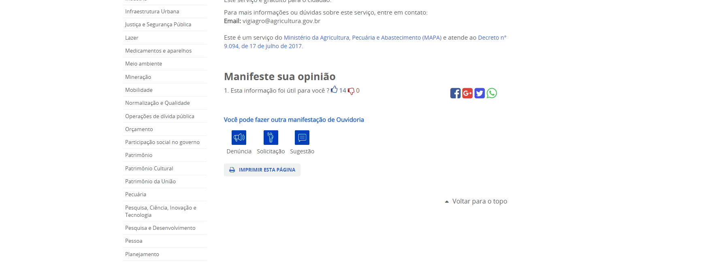
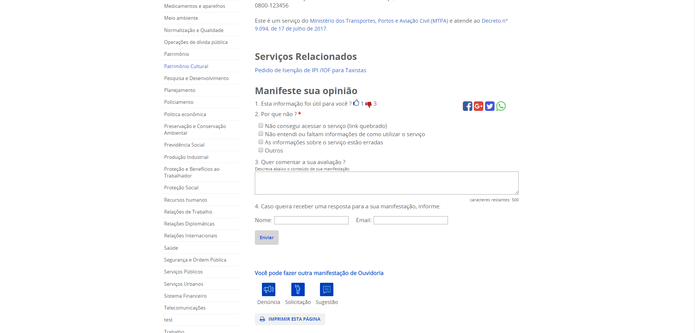

# E-OUV

## Avaliação das Informações de Serviços

O portal de serviços está integrado com o sistema da Ouvidoria Geral da União o [E-OUV](https://sistema.ouvidorias.gov.br/publico/Manifestacao/RegistrarManifestacao.aspx). O Portal de Serviços permite que o cidadão realize uma avaliação das informações dos serviços cadastrados. O cidadão pode avaliar positivamente a informação clicando o "joinha" para cima ou negativamente a informação clicando no "joinha" para baixo. Essa avaliação está localizada em todos os serviços depois de todos os campos. 

Quando um usuário avalia positivamente a informação é enviada uma manifestação para o E-OUV do tipo elogio, preenchendo a manifestação com os dados do serviço.

Quando um usuário avalia negativamente a informação é enviada uma manifestação para o E-OUV do tipo reclamação e aberta algumas opções para que o cidadão diga o porque aquela informação não está sendo útil. Além disso dois campos são abertos para que o cidadão possa colocar seu e-mail e nome para caso queira acompanhar sua manifestação.

Para mais informações: https://redmine.planejamento.gov.br/projects/sti-portal-de-servicos-do-governo-federal/wiki/US006_-_Id_017_Id_018_-_Implementa%C3%A7%C3%A3o_de_m%C3%B3dulo_de_avalia%C3%A7%C3%A3o_no_portal_-_VERS%C3%83O_2
 
