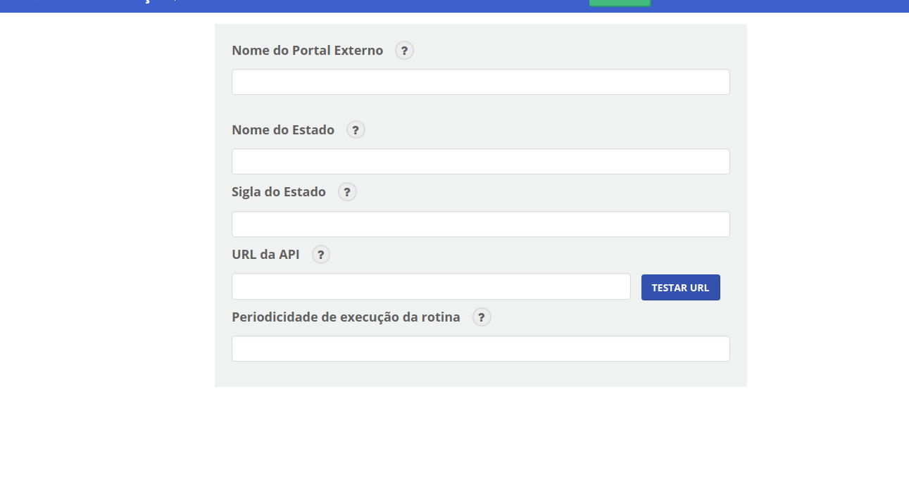
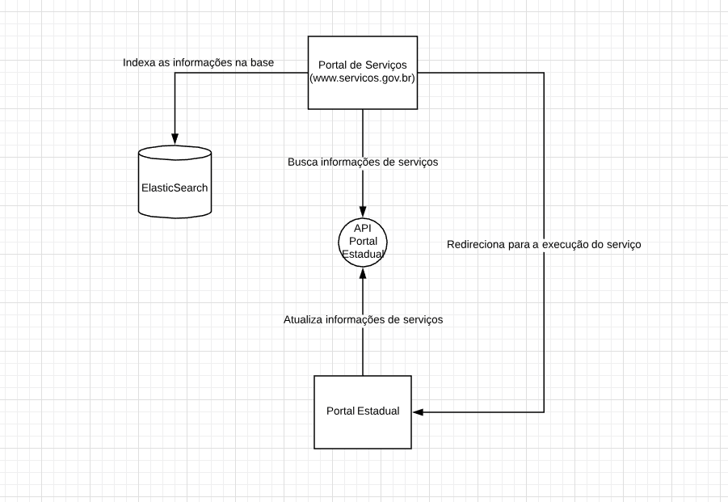

# Portais Estaduais e Municipais

## Rotina de Integração com Serviços Estaduais

O Portal de Serviços executa uma rotina  automática e periódica que busca as informações de serviços nas APIs dos Portais Estaduais cadastrados. A rotina busca os metadados de nome, descrição, nomes populares, palavras chaves e url de execução do serviço conforme seção **Passos da Integração** mais abaixo.

Existe uma área no Editor de Serviços que faz o cadastro da API de serviço no Portal Estadual. São cadastrados o Nome do Portal, Nome do Estado, Sigla do Estado, URL da API e Periodicidade de execução da rotina que rotina busca as informações.

[](./editorcadastroestado.png)


## Fluxo de Importação

[](./integracaoportalestadual.png)


## Passos da Integração

Os portais de servicos estaduais e municipais que desejem ter seus serviços públicos exibidos no Portal de Serviços Federal devem ter um endpoint em XML ou JSON que lista os serviços com name, description, url, popular_names, keywords:

Atenção: O endpoint tem que ser público sem nenhum tipo de autenticação.

```
{
id (string, optional): ID do Serviço,
name (string): Nome do Serviço,
description (string): Descrição do Serviço,
url (url): URL para mais detalhes do Serviço,
date (date, optional): Data que o Serviço foi publicado no portal,
organization (Object {name, id, url}, optional): Organização/Órgão do Serviço,
popular_names (Array[name: string], optional): Nomes populares do Serviço,
keywords (Array[name: string], optional): Palavras Chaves relacionadas ao Serviço
}
```


Exemplo em JSON:
```json
[{
    "id": "ASDPO1234",
    "name": "Serviço para o cidadão",
    "description": "Descrição detalhada do serviço.",
    "url": "https://www.meuportal.gov.br/servicos/servico-para-cidadao",
    "date": "2001-10-26T16:06:46Z",
    "organization": {
        "name": "Departamento para o cidadão",
        "id": "DPT-123asAD",
        "url": "https://www.meuportal.gov.br/orgao/departamento-para-cidadao"
      },
    "popular_names": [
      {
        "name": "Serviço importante",
      },
      {
        "name": "Outro nome popular",
      }
    ],
    "keywords": [
      {
        "name": "Obter serviço",
      },
      {
        "name": "SPC",
      }
    ]
},
{ ... }
]
```

Após a disponibilização desse endpoint entre em contato com os responsáveis pelo Portal de Serviços para que possam configurar a integração.

## Visualização no Portal de Serviços

Na pesquisa a visualização no Portal de Serviços Federais será :

[](./pesquisa_servicos.png)

A visualização dos detalhes no Portal de Serviços Federais será:

[](./template_servico.png)
