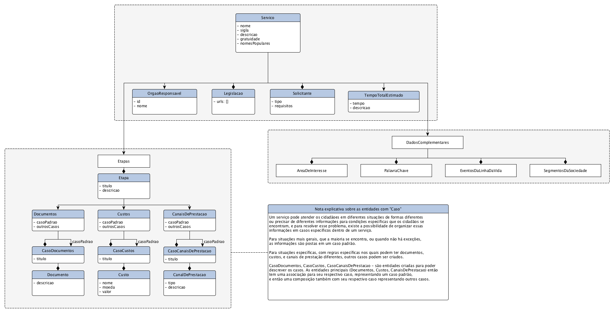

# Entidades e relacionamentos

As instâncias das definições dos serviços existentes estão disponíveis em formato XML no [repositório oficial do projeto][REPO]. 

Todas elas seguem o seguinte modelo de entidades e relacionamentos: 

[CARTAS]: https://github.com/servicosgovbr/cartas-de-servico/tree/master/cartas-servico/v3
[REPO]: https://github.com/servicosgovbr/cartas-de-servico
[DOCS]: http://servicosgovbr.github.io/
