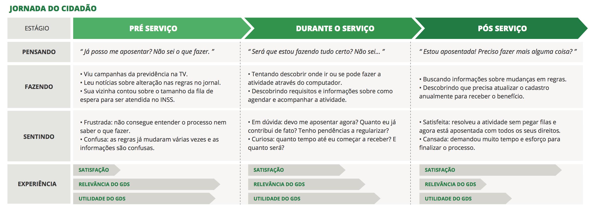

# Joana - Aposentando

## Oportunidades percebidas

**Empatia e interações mais humanas:** Entender que o cidadão está confuso, ansioso, e precisa do governo para conseguir atingir seu objetivo. Ser mais humano nas interações poderá fazer com que ele se sinta mais seguro e atendido pelo governo.

**Proposta de valor clara:** Cada pessoa é diferente, e precisamos estar atentos para que todos os envolvidos entendam quais níveis de maturidade de serviços serão atingidos através do Portal de Serviços e estejam bem informados sobre o passo a passo para atingir seu objetivo.

**Oportunidade de valor:** Para que os serviços possam ser evoluídos é importante que a oportunidade de dar seu feedback seja fácil e intencional. É necessário mostrar a importância e o benefício do cidadão ser atuante no processo de melhoria do Portal de Serviços.

**O cidadão é o melhor distribuidor:** A partir de uma experiência gratificante, o cidadão se torna o maior defensor do Portal de Serviços. Dar os meios para que ele possa se emponderar e compartilhar com amigos e familiares sobre sua experiência é a chave para que ele seja nosso maior distribuidor.